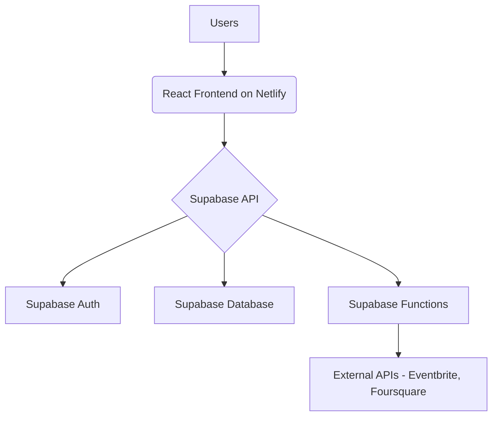

# Kunajoto Project Documentation

## 1. Project Overview

**Kunajoto** is a vibe-based venue discovery platform designed to help users find bars, clubs, and restaurants based on real-time "vibe" scores. The application provides a dynamic and interactive map interface that visualizes venue popularity and atmosphere, enabling users to make informed decisions about where to go.

### 1.1. Goal

The primary goal of Kunajoto is to provide a curated and personalized nightlife experience by leveraging real-time data, user preferences, and AI-driven recommendations. The platform aims to connect users with venues that match their desired atmosphere, crowd, and music preferences.

### 1.2. Target Audience

- Socially active individuals looking for new and exciting venues
- Tourists and travelers seeking local nightlife experiences
- Event planners and groups organizing social outings
- Venue owners and managers looking to attract more customers

## 2. Tech Stack

Kunajoto is built on a modern and scalable tech stack that emphasizes performance, developer experience, and ease of deployment.

| Category      | Technology                                       |
|---------------|--------------------------------------------------|
| **Frontend**  | React, Vite, TypeScript, Tailwind CSS            |
| **Backend**   | Supabase (PostgreSQL, Auth, Functions)           |
| **Mapping**   | Google Maps Platform                             |
| **AI/ML**     | Google Gemini (for AI Chat)                      |
| **Deployment**| Netlify                                          |

### 2.1. Frontend

- **React**: A popular JavaScript library for building user interfaces.
- **Vite**: A fast and modern build tool that provides a seamless development experience.
- **TypeScript**: A statically typed superset of JavaScript that enhances code quality and maintainability.
- **Tailwind CSS**: A utility-first CSS framework for rapidly building custom designs.

### 2.2. Backend

- **Supabase**: An open-source Firebase alternative that provides a suite of backend services:
  - **PostgreSQL**: A powerful and reliable relational database.
  - **Auth**: Secure user authentication and management.
  - **Functions**: Serverless functions for custom backend logic.

### 2.3. Mapping

- **Google Maps Platform**: Provides mapping services, including:
  - **Maps JavaScript API**: For embedding interactive maps.
  - **Places API**: For retrieving venue information.
  - **Geocoding API**: For converting addresses to geographic coordinates.

### 2.4. AI/ML

- **Google Gemini**: A large language model from Google used for the AI Chat feature, providing conversational search and recommendations.

### 2.5. Deployment

- **Netlify**: A platform for deploying and hosting modern web applications with built-in CI/CD and serverless functions support.

## 3. Key Features

Kunajoto offers a rich set of features designed to enhance the user experience and provide valuable insights into the local nightlife scene.

- **Vibe-based Map**: A dynamic map that visualizes venues with real-time "vibe" scores, represented by color-coded markers.
- **Venue Details**: Comprehensive venue profiles with information such as address, hours, vibe score, reviews, and photos.
- **User Authentication**: Secure and easy-to-use authentication with email/password and social logins.
- **User Profiles**: Personalized user profiles with the ability to save preferences and view activity history.
- **Favorites**: Users can save their favorite venues for quick access.
- **AI Chat**: An intelligent chatbot that provides personalized recommendations and answers questions about venues.
- **Admin Dashboard**: A dashboard for administrators to manage venues, users, and other application data.
- **Onboarding**: A guided tour for new users to introduce them to the app's features.
- **Preference Flow**: A step-by-step process for users to set their preferences for music, crowd, and vibe.
- **Subscription Plans**: Premium features and content available through a subscription model.

## 4. Data Flow and Architecture

The application follows a modern client-server architecture with a clear separation of concerns between the frontend and backend.

1.  **User Interaction**: Users interact with the React frontend, which is hosted on Netlify.
2.  **API Communication**: The frontend communicates with the Supabase backend via a RESTful API.
3.  **Authentication**: Supabase Auth handles user registration, login, and session management.
4.  **Data Storage**: Supabase Database (PostgreSQL) stores all application data, including users, venues, reviews, and favorites.
5.  **Backend Logic**: Supabase Functions are used for custom backend logic, such as data ingestion from external APIs.
6.  **Data Ingestion**: Serverless functions periodically fetch data from external sources like Eventbrite and Foursquare to keep venue information up-to-date.

## 5. Deployment

Kunajoto is deployed on Netlify, which provides a seamless and automated deployment workflow.

- **Continuous Deployment**: Every push to the `main` branch on GitHub automatically triggers a new build and deployment on Netlify.
- **Environment Variables**: API keys, database credentials, and other secrets are securely managed using Netlify's environment variables.
- **Serverless Functions**: Supabase Functions are deployed and managed through the Supabase CLI and are automatically available to the frontend.

## 6. Future Enhancements

- **Real-time Vibe Updates**: Implement websockets to provide real-time updates of venue vibe scores.
- **Social Features**: Allow users to connect with friends, share plans, and see where their friends are going.
- **Gamification**: Introduce badges, leaderboards, and other gamification elements to increase user engagement.
- **Expanded Data Sources**: Integrate with more data sources to provide a wider range of venue information.
- **Advanced AI Recommendations**: Enhance the AI Chat with more advanced recommendation algorithms based on user behavior and context.
